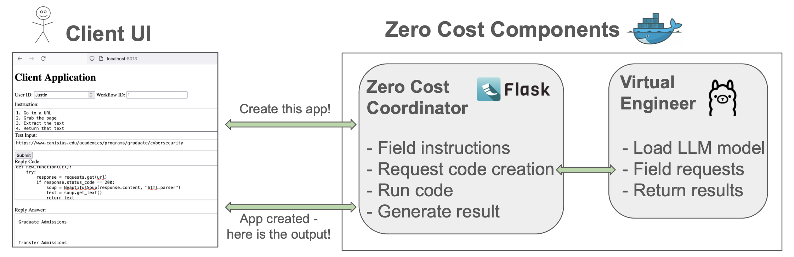
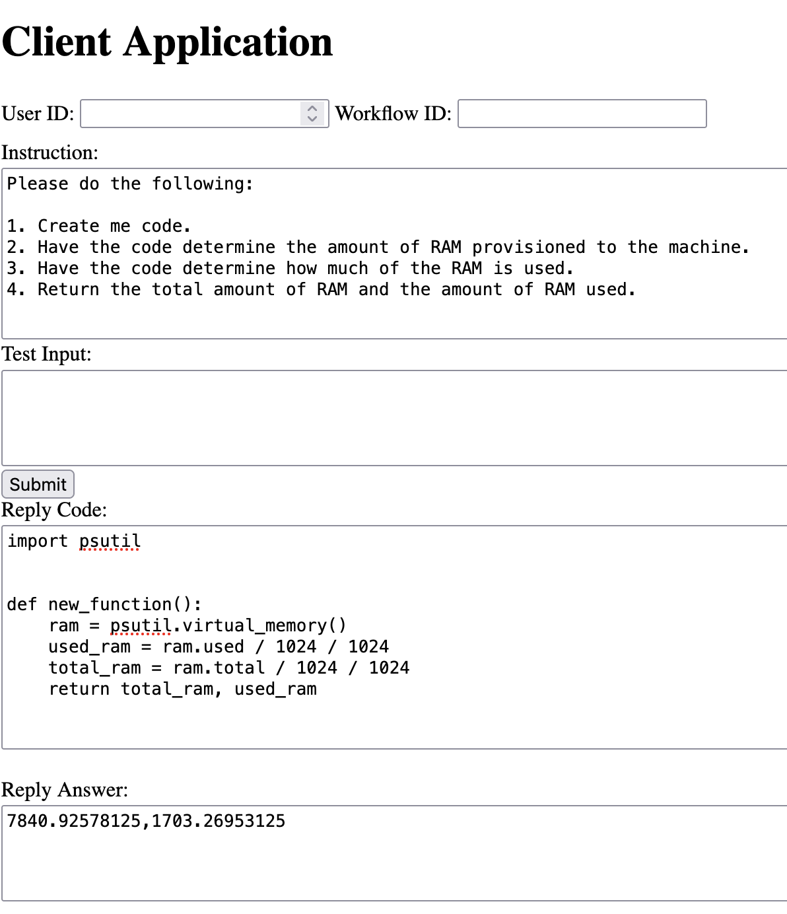
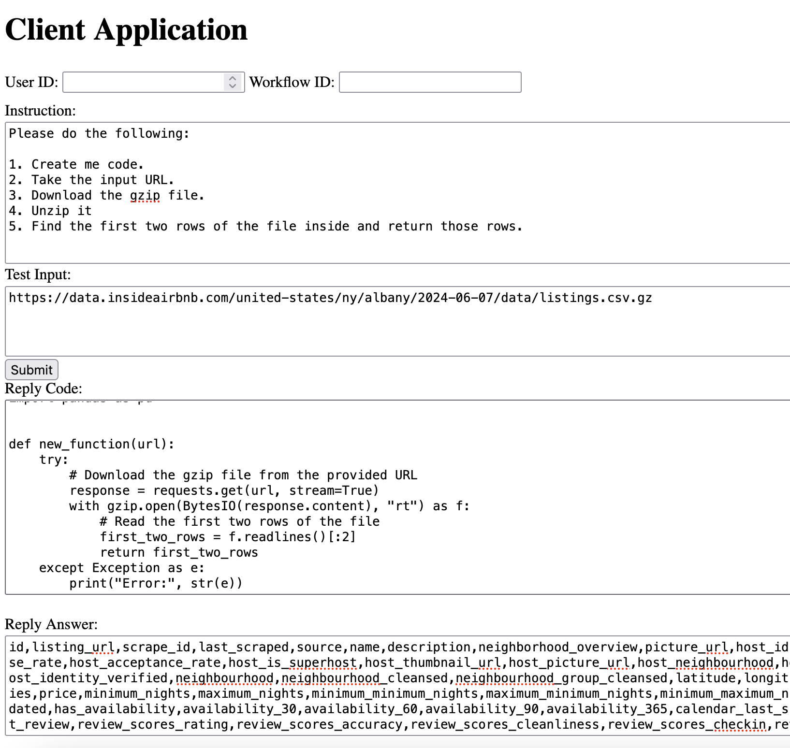

# Zero Cost 
### Your Virtual Software Engineer!

Welcome to Zero Cost.  This is a first iteration of a virtual software engineer.  It will eventually help you develop
all sorts of software that you imagine but do not have the time or engineering skill to develop.

### Pre-Reqs

You will need a system with a Docker Engine installed.  That is it - that's all!  Here is a link to learn about Docker and install it on your machine: https://www.docker.com/

To run it - simply issue this command from a terminal:

```docker-compose up```

and of course to turn it off issue this command.  You can also Ctrl-c out of the running terminal.  

```docker-compose down```

### Framework Description

Currently Zero Cost is composed of two containers.  The listing of containers is provided in the `` `docker-compose.yaml` `` 
file. 

**flask_server** - This creates a Python container running the Flask server with Zero Cost's business logic.  
Its entry point is app.py.  Give the logic a read.  In a nutshell, it does the following:

1. Receives the users request from the Authoring UI,
2. Sends out the request to create the runnable code to Ollama,
3. Receives the Ollama reply,
3. Runs it,
4. Sends back the result - for better or worse - to the Authoring UI.

Many moving parts here!  The flask server has to get the code back and 'compile it' and then load it real time.  
Note, this Flask server will eventually spin up its own Docker contaienrs (or container microservices) to run the 
returned code.  This is a more elegant solution.

**ollama** - This creates an Ollama container.  As user's make requests to develop an application, this is the 
part of the virtual engineer that provides the raw code.  The flask_server receives and stictches together the 
code and runs the application.  The ollama container can be instructed to use different LLM's to produce a reply.

One item to note in the compose file.  The ollama server uses models that have been downloaded locally.  It could work either 
way, with the models downloaded by the container.  But they would need to be persisted across container restarts.  
Having a local folder with the models persisted across restarts is the way to go.

### Application Use

The docker-compose.yml opens port 8013 to the local machine.  This is needed for the Web browser to commmunicate with the
flask_server container.  As a component diagram, here is what Zero Cost looks like:



Here are two images that show how to use Zero Cost.  The first image has a user ask for a Python program that can find 
the amount of RAM on the machine where the code will be run and then, the amount of RAM used.  You can see in the reply answer at bottom that this worked.  It might take a few clicks of the submit - but it will work!

<p style="text-align:left;">
  
</p>

The second image asks again for a Python program.  It takes in an argument, in this case a URL.  It instructs the program
to unzip the file and then pull out the first two rows of the CSV.  You can see in the reply that this worked!

<p style="text-align:left;">
  
</p>

### Next Steps

There is a lot more to come!  This blog post explains what will happen next with Zero Cost!
